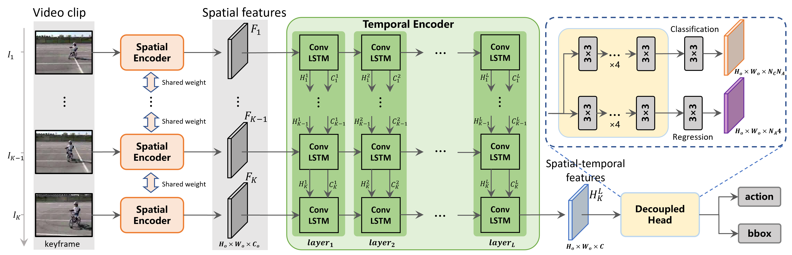
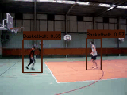
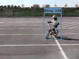
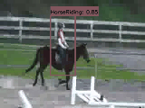
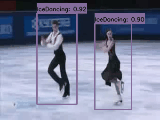
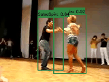

# YOWOF
You Only Watch One Frame (YOWOF) for Online Spatio-Temporal Action Detection



# Requirements
- We recommend you to use Anaconda to create a conda environment:
```Shell
conda create -n yowof python=3.6
```

- Then, activate the environment:
```Shell
conda activate yowof
```

- Requirements:
```Shell
pip install -r requirements.txt 
```

# Dataset
You can download **UCF24** and **JHMDB21** from the following links:

## Google Drive
## UCF101-24:
* Google drive

Link: https://drive.google.com/file/d/1Dwh90pRi7uGkH5qLRjQIFiEmMJrAog5J/view?usp=sharing

* BaiduYun Disk

Link: https://pan.baidu.com/s/11GZvbV0oAzBhNDVKXsVGKg

Password: hmu6 

## JHMDB21: 
* Google drive

Link: https://drive.google.com/file/d/15nAIGrWPD4eH3y5OTWHiUbjwsr-9VFKT/view?usp=sharing

* BaiduYun Disk

Link: https://pan.baidu.com/s/1HSDqKFWhx_vF_9x6-Hb8jA 

Password: tcjd 

## AVA
You can use instructions from [here](https://github.com/yjh0410/AVA_Dataset) to prepare **AVA** dataset.

# Visualization









# Experiment
* Frame-mAP@0.5IoU & Video-mAP@0.5IoU on UCF24

|    Model    |   Clip  |    FPS    |  GFLOPs |  F-mAP |  V-mAP |   Weight   |
|-------------|---------|-----------|---------|--------|--------|------------|
|  YOWOF-R18  |   16    |     225   |   4.9   |  83.3  |  49.1  | [ckpt](https://github.com/yjh0410/YOWOF/releases/download/yowof-weight/yowof-r18_epoch_5_83.3.pth) |

* Frame-mAP@0.5 IoU on AVA_v2.2

|     Model     |   Clip  |    FPS    |  GFLOPs | Params |  mAP   |   Weight   |
|---------------|---------|-----------|---------|--------|--------|------------|
|   YOWOF-R18   |   16    |    220    |   5.0   | 23.9 M |  18.1  | [ckpt](https://github.com/yjh0410/YOWOF/releases/download/yowof-weight/yowof-r18_epoch_8_18.1.pth) |
|   YOWOF-R50   |   16    |    125    |   11.1  | 50.5 M |  20.7  | [ckpt](https://github.com/yjh0410/YOWOF/releases/download/yowof-weight/yowof-r50_epoch_8_20.7.pth) |

## Train YOWOF
### Train yowof-r18 on UCF24

```Shell
python train.py --cuda -d ucf24 -v yowof-r18 --num_workers 4 --eval_epoch 1 --eval
```

or you can just run the script:

```Shell
sh train_ucf.sh
```

### Train yowof-r50 on AVA_v2.2

```Shell
python train.py --cuda -d ava_v2.2 -v yowof-r50 --num_workers 4 --eval_epoch 1 --eval
```

or you can just run the script:

```Shell
sh train_ava.sh
```

## Test YOWOF
### Test yowof-r18 on UCF24

* run yowof with *clip* inference mode

```Shell
python test.py --cuda -d ucf24 -v yowof-r18 --weight path/to/weight --inf_mode clip --show
```

* run yowof with *stream* inference mode

```Shell
python test.py --cuda -d ucf24 -v yowof-r18 --weight path/to/weight --inf_mode stream --show
```

### Test yowof-r50 on AVA_v2.2

* run yowof with *clip* inference mode

```Shell
python test.py --cuda -d ava_v2.2 -v yowof-r50 --weight path/to/weight --inf_mode clip --show
```

* run yowof with *stream* inference mode

```Shell
python test.py --cuda -d ava_v2.2 -v yowof-r50 --weight path/to/weight --inf_mode stream --show
```

## Evaluate YOWOF
* on UCF24
```Shell
# frame mAP
python eval.py \
        --cuda \
        -d ucf24 \
        -v yowof-r18 \
        --weight path/to/weight \
        --cal_frame_mAP
```

Our ```Frame-mAP@0.5IoU``` achieved by ```YOWOF-R18``` on UCF24:
```Shell
AP: 79.05% (1)
AP: 97.07% (10)
AP: 83.96% (11)
AP: 64.24% (12)
AP: 72.87% (13)
AP: 94.46% (14)
AP: 88.25% (15)
AP: 93.32% (16)
AP: 78.41% (17)
AP: 94.25% (18)
AP: 97.36% (19)
AP: 45.69% (2)
AP: 96.13% (20)
AP: 82.96% (21)
AP: 79.45% (22)
AP: 54.20% (23)
AP: 92.01% (24)
AP: 88.81% (3)
AP: 78.68% (4)
AP: 70.28% (5)
AP: 95.14% (6)
AP: 92.11% (7)
AP: 89.49% (8)
AP: 91.70% (9)
mAP: 83.33%
```

```Shell
# video mAP
python eval.py \
        --cuda \
        -d ucf24 \
        -v yowof-r18 \
        --weight path/to/weight \
        --cal_video_mAP
```

Our ```Video-mAP@0.5IoU``` achieved by ```YOWOF-R18``` on UCF24:

```Shell
-------------------------------
V-mAP @ 0.05 IoU:
--Per AP:  [87.71, 93.6, 68.66, 96.26, 79.63, 100.0, 82.72, 100.0, 93.36, 96.08, 44.8, 91.01, 91.87, 99.76, 23.33, 98.87, 90.87, 96.55, 91.46, 65.01, 72.97, 49.67, 86.4, 87.96]
--mAP:  82.86
-------------------------------
V-mAP @ 0.1 IoU:
--Per AP:  [87.71, 91.01, 68.66, 93.73, 79.63, 100.0, 82.72, 100.0, 93.36, 96.08, 44.8, 87.62, 91.87, 99.76, 23.33, 98.87, 90.87, 96.55, 91.46, 63.46, 70.97, 49.67, 57.29, 87.96]
--mAP:  81.14
-------------------------------
V-mAP @ 0.2 IoU:
--Per AP:  [58.88, 84.02, 64.38, 78.9, 38.04, 100.0, 82.72, 100.0, 82.5, 96.08, 44.8, 84.75, 91.87, 99.76, 22.2, 98.87, 90.87, 96.55, 91.46, 61.48, 49.51, 48.3, 32.85, 87.96]
--mAP:  74.45
-------------------------------
V-mAP @ 0.3 IoU:
--Per AP:  [8.66, 28.1, 64.38, 69.77, 12.2, 84.79, 77.96, 100.0, 82.5, 92.68, 44.8, 72.98, 75.96, 99.76, 16.23, 98.87, 90.87, 96.55, 91.46, 51.32, 30.98, 43.29, 3.24, 80.77]
--mAP:  63.25
-------------------------------
V-mAP @ 0.5 IoU:
--Per AP:  [0.0, 1.75, 53.12, 35.56, 0.66, 40.99, 62.67, 90.6, 49.47, 89.94, 44.8, 57.89, 48.27, 99.76, 4.81, 98.87, 85.47, 89.53, 87.81, 44.64, 0.45, 20.97, 0.0, 69.87]
--mAP:  49.08
-------------------------------
V-mAP @ 0.75 IoU:
--Per AP:  [0.0, 0.0, 22.6, 0.0, 0.0, 1.11, 27.9, 64.31, 11.68, 42.35, 21.51, 34.02, 0.8, 40.54, 0.92, 80.21, 44.81, 19.75, 80.34, 18.34, 0.0, 0.92, 0.0, 35.32]
--mAP:  22.81
```
* on AVA_v2.2

```Shell
python eval.py --cuda -d ucf24 -v yowof-r50 --weight path/to/weight
```

Our SOTA result achieved by ```YOWOF-R50``` on AVA_v2.2:
```Shell
  'AP@0.5IOU/answer phone': 0.701,
  'AP@0.5IOU/bend/bow (at the waist)': 0.358,
  'AP@0.5IOU/carry/hold (an object)': 0.496,
  'AP@0.5IOU/climb (e.g., a mountain)': 0.007,
  'AP@0.5IOU/close (e.g., a door, a box)': 0.087,
  'AP@0.5IOU/crouch/kneel': 0.178,
  'AP@0.5IOU/cut': 0.026,
  'AP@0.5IOU/dance': 0.295,
  'AP@0.5IOU/dress/put on clothing': 0.006,
  'AP@0.5IOU/drink': 0.223,
  'P@0.5IOU/drive (e.g., a car, a truck)': 0.531,
  'AP@0.5IOU/eat': 0.209,
  'AP@0.5IOU/enter': 0.0345,
  'AP@0.5IOU/fall down': 0.098,
  'AP@0.5IOU/fight/hit (a person)': 0.348,
  'AP@0.5IOU/get up': 0.092,
  'AP@0.5IOU/give/serve (an object) to (a person)': 0.057,
  'AP@0.5IOU/grab (a person)': 0.046,
  'AP@0.5IOU/hand clap': 0.019,
  'AP@0.5IOU/hand shake': 0.014,
  'AP@0.5IOU/hand wave': 0.004,
  'AP@0.5IOU/hit (an object)': 0.006,
  'AP@0.5IOU/hug (a person)': 0.217,
  'AP@0.5IOU/jump/leap': 0.093,
  'AP@0.5IOU/kiss (a person)': 0.398,
  'AP@0.5IOU/lie/sleep': 0.581,
  'AP@0.5IOU/lift (a person)': 0.027,
  'AP@0.5IOU/lift/pick up': 0.021,
  'AP@0.5IOU/listen (e.g., to music)': 0.014,
  'AP@0.5IOU/listen to (a person)': 0.565,
  'AP@0.5IOU/martial art': 0.329,
  'AP@0.5IOU/open (e.g., a window, a car door)': 0.133,
  'AP@0.5IOU/play musical instrument': 0.282,
  'AP@0.5IOU/point to (an object)': 0.001,
  'AP@0.5IOU/pull (an object)': 0.022,
  'AP@0.5IOU/push (an object)': 0.016,
  'AP@0.5IOU/push (another person)': 0.087,
  'AP@0.5IOU/put down': 0.030,
  'AP@0.5IOU/read': 0.270,
  'AP@0.5IOU/ride (e.g., a bike, a car, a horse)': 0.251,
  'AP@0.5IOU/run/jog': 0.283,
  'AP@0.5IOU/sail boat': 0.250,
  'AP@0.5IOU/shoot': 0.005,
  'AP@0.5IOU/sing to (e.g., self, a person, a group)': 0.104,
  'AP@0.5IOU/sit': 0.790,
  'AP@0.5IOU/smoke': 0.040,
  'AP@0.5IOU/stand': 0.778,
  'AP@0.5IOU/swim': 0.227,
  'AP@0.5IOU/take (an object) from (a person)': 0.047,
  'AP@0.5IOU/take a photo': 0.060,
  'AP@0.5IOU/talk to (e.g., self, a person, a group)': 0.688,
  'AP@0.5IOU/text on/look at a cellphone': 0.061,
  'AP@0.5IOU/throw': 0.007,
  'AP@0.5IOU/touch (an object)': 0.388,
  'AP@0.5IOU/turn (e.g., a screwdriver)': 0.014,
  'AP@0.5IOU/walk': 0.542,
  'AP@0.5IOU/watch (a person)': 0.663,
  'AP@0.5IOU/watch (e.g., TV)': 0.177,
  'AP@0.5IOU/work on a computer': 0.099,
  'AP@0.5IOU/write': 0.041,
  'mAP@0.5IOU': 0.207
```
## Detect AVA video

```Shell
python test_video_ava.py --cuda -d ucf24 -v yowof-r50 --weight path/to/weight --video ava/video/name
```

## Demo
* detection action instances with UCF24 labels

We provide some test videos of UCF24 in ```dataset/demo/ucf24_demo/```.

```Shell
python demo.py --cuda -d ucf24 -v yowof-r18 --weight path/to/weight --video ./dataset/demo/ucf24_demo/v_Basketball_g01_c02.mp4
```

* detection action instances with AVA labels

```Shell
python demo.py --cuda -d ava_v2.2 -v yowof-r50 --weight path/to/weight --video path/to/video
```
